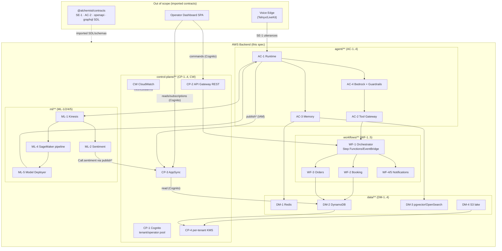
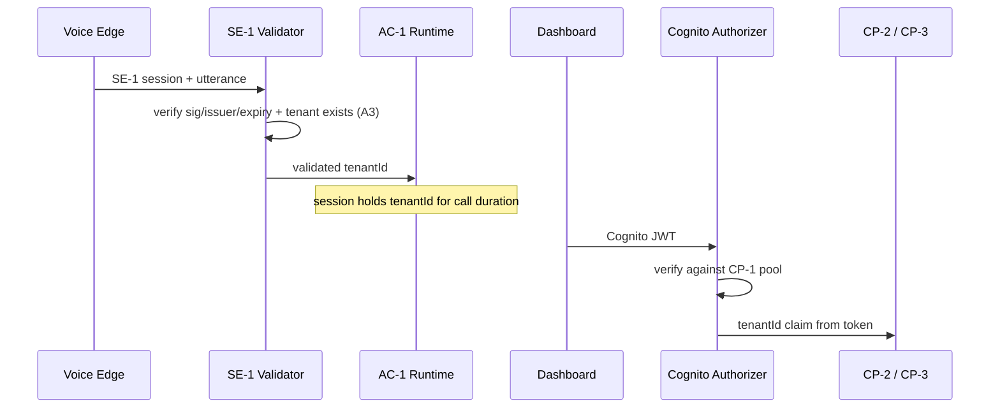
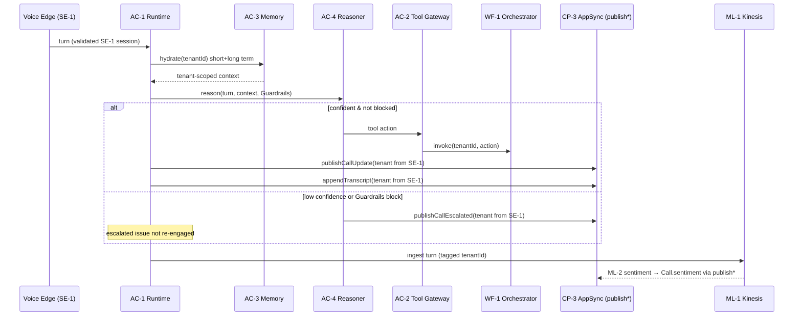

# Design Document

## Overview

This document describes the design of the **AWS backend** for the Alchemist Business OS ("1145 AI") platform — the reasoning, workflow, data, ML, and control-plane layer behind an AI voice agent for small businesses. The backend is a **CDK serverless** application. It receives caller utterances over the **SE-1** boundary from a separate voice edge (Telnyx/LiveKit) and pushes live call state to the operator dashboard over the **CP-3** AppSync boundary.

**Scope.** This design covers ONLY the AWS backend. The voice edge, dashboard SPA, investor portal, and the `@alchemist/contracts` package are out of scope and are **imported, never authored**. Specifically, the backend imports and consumes:

- **SE-1 proto** — the voice-edge → backend session/utterance contract.
- **AC-2 tool schema** — the tool-invocation contract used by the Tool Gateway.
- **CP-2 `openapi.yaml`** — the REST command contract.
- **CP-3 `graphql/schema.graphql`** — the AppSync GraphQL SDL.

The design is organized to the steering folder convention so that fileMatch steering applies correctly: `agent/**` (AgentCore AC-1..4), `workflows/**` (WF-1..5), `data/**` (DM-1..4), `ml/**` (ML-1/2/4/5), `control-plane/**` (CP-1..4 + CW). The CDK app mirrors this layout one-to-one.

### Cross-cutting principle: multi-tenant isolation

Every design decision is subordinate to one non-negotiable invariant: **no operation may read, write, cache, or observe another tenant's data.** This manifests as four concrete rules enforced at every layer:

1. Every persisted record carries `PK = TENANT#<tenantId>`.
2. No data query executes without a tenant scope.
3. The operative `tenantId` is always derived from a **Validated_Session** — a Cognito session (CP-1) for dashboard/REST traffic, or an independently **validated SE-1 session** for voice traffic — never from a client-supplied field alone.
4. Each tenant's data at rest is encrypted under that tenant's dedicated CP-4 KMS key.

### Design assumptions (flagged for user revisit)

The approved requirements left three points open. This design makes the following choices and calls them out explicitly so they can be revisited:

- **A1 — Recording consent (R20.2).** The backend **enforces the consent gate itself** before storing any audio. A consent signal arriving from the voice edge over SE-1 is treated as *input* to the gate, not as authorization. The backend persists a consent record per Call/jurisdiction and checks it immediately before any `PutObject` of audio. This is conservative: if the consent state is absent or ambiguous, audio is not stored.
- **A2 — Model promotion (R24.1).** Promotion is **automatic** when a registered model's eval metrics exceed the deployed model's metrics, as required. A **configurable approval-gate hook** (default: disabled/auto-promote) is inserted before the runtime update so an operator can require manual sign-off without code changes.
- **A3 — SE-1 session validation.** The backend **independently validates** the SE-1 session and its `tenantId` claim (signature/issuer/expiry + tenant existence checks) rather than trusting the middleware's assertion. Only a validated SE-1 session may set the tenant on a Publish_Mutation or open an AC_Runtime session.

## Architecture

### System context



### CDK organization

The CDK app composes one top-level `BackendApp` with stacks aligned to the folder convention. Constructs are grouped so a stack failure has a bounded blast radius and so per-group steering applies.

| CDK Stack | Folder | Owns |
|---|---|---|
| `ControlPlaneStack` | `control-plane/**` | CP-1 Cognito user pool, CP-2 REST API (from `openapi.yaml`), CP-3 AppSync (from imported SDL) + resolvers, CP-4 per-tenant KMS key provisioning, CW metrics/alarms |
| `AgentStack` | `agent/**` | AC-1 Runtime, AC-2 Tool Gateway, AC-3 Memory, AC-4 Bedrock Reasoner (forked from `awslabs/amazon-bedrock-agentcore-samples`) |
| `WorkflowStack` | `workflows/**` | WF-1 Step Functions state machine + EventBridge bus, WF-2 Booking Lambda, WF-3 Orders Lambda, WF-4/5 Notification Lambdas (SES, SNS/Pinpoint) |
| `DataStack` | `data/**` | DM-1 Redis (ElastiCache), DM-2 DynamoDB single table, DM-3 pgvector (Aurora/OpenSearch), DM-4 S3 lake |
| `MlStack` | `ml/**` | ML-1 Kinesis stream, ML-2 Sentiment Lambda, ML-4 SageMaker pipeline + registry, ML-5 Model Deployer |

Cross-stack references are passed via stack outputs / SSM parameters (table name, KMS key alias map, AppSync API ID, state machine ARN). The `DataStack` and `ControlPlaneStack` (KMS) are deployed first because every other stack depends on the table and keys.

### Two trust boundaries, two session validators

The backend has exactly two ways a `tenantId` enters the system, and each has its own validator. Nothing else may originate a tenant.



- **SE-1 Validator** (`agent/session/se1_validator`): independently validates the incoming SE-1 session per assumption A3. Output is a trusted `tenantId` that seeds the AC_Runtime session and is the only acceptable source for the tenant on a Publish_Mutation.
- **Cognito Authorizer** (CP-1): the API Gateway authorizer for CP-2 and the `@aws_cognito_user_pools` provider for CP-3 reads/subscriptions. The `tenantId` is read from the verified token claim.

### Per-turn live-state flow (AgentCore → CP-3)



## Components and Interfaces

### Control plane

#### CP-1 — Cognito tenant/operator user pool
- A dedicated `UserPool` for tenant/operator identities, provisioned in `ControlPlaneStack`. It is physically and logically separate from the investor-portal pool (which lives in the frontend's Amplify project and is never referenced here).
- Each operator user carries a `custom:tenantId` attribute, populated at provisioning/invitation time. Authentication issues tokens whose claims include `tenantId`.
- Exposes a Cognito authorizer used by CP-2 and a user-pool auth provider used by CP-3.
- **Interface:** `tenantId = validatedClaims["custom:tenantId"]`. A request with no valid token is rejected (401/authorization error) before any handler runs.

#### CP-2 — API Gateway REST API
- A REST API **imported from the contracts `openapi.yaml`** via spec import (`SpecRestApi`). The repository never re-declares paths, schemas, or models; it references the contract artifact at synth time.
- Request validation is driven by the imported spec (model validation enabled). Non-conforming requests are rejected with a validation error before reaching integrations.
- Every method is protected by the CP-1 Cognito authorizer. Handlers derive `tenantId` from the authorizer context and route fulfillment to WF-1.
- **Interface:** `POST /commands/...` (shapes owned by `openapi.yaml`) → handler → `WF-1.start(tenantId, command)`.

#### CP-3 — AppSync GraphQL API
- Provisioned with the **SDL loaded from `@alchemist/contracts` `graphql/schema.graphql`** (`SchemaFile.fromAsset` / definition string read from the imported artifact). Types are never re-authored in CDK; the SDL is the single source of truth.
- **Auth modes:** primary `AMAZON_COGNITO_USER_POOLS` (CP-1) for `Query`/`Subscription`; additional `AWS_IAM` for the `publish*` mutations. This matches the `@aws_cognito_user_pools` / `@aws_iam` directives carried in the imported SDL.
- **Resolvers:**
  - **Read/Subscription resolvers** (`@aws_cognito_user_pools`): resolve against DynamoDB (DM-2) with a key condition pinned to `PK = TENANT#<tenantId>`, where `tenantId` comes from the Cognito identity in the resolver context. Any `tenant` argument on a subscription is applied **only as an additional filter** and can never widen scope beyond the session tenant.
  - **Publish resolvers** (`@aws_iam`): `publishCallUpdate`, `appendTranscript`, `publishLead`, `publishCallEscalated`. These are **no-op fan-out resolvers** (NONE/local data source): they set the tenant on the payload from the validated SE-1 session passed by the caller, perform **no persistent write**, and return the payload so AppSync delivers it to matching subscriptions.
- **Write rule:** CP-3 accepts no user-facing writes. User-facing writes arrive only on CP-2 REST.
- **Interface (consumed, not declared):** `publishCallUpdate(call)`, `appendTranscript(segment)`, `publishLead(lead)`, `publishCallEscalated(call)` — argument shapes owned by the imported SDL.

#### CP-4 — Per-tenant KMS keys
- A per-tenant KMS key strategy: one symmetric KMS key per tenant, addressed by alias `alias/tenant/<tenantId>`. Keys are created as part of tenant onboarding (a `TenantProvisioning` custom resource / onboarding Lambda) rather than statically in the synth, so the key set scales with tenants.
- Key policies grant encrypt/decrypt only to the roles operating within that tenant's context. A single helper (`data/crypto/tenant_key.ts`) resolves the correct key for a given `tenantId`; callers never pass a raw key ARN.
- **Interface:** `keyForTenant(tenantId) -> kmsKeyArn`. Storage operations (DM-2, DM-4) pass this key; a mismatched tenant/key pairing is structurally impossible because the resolver derives the key from the same `tenantId` used for the `PK`.

### AgentCore (`agent/**`, forked from `awslabs/amazon-bedrock-agentcore-samples`)

#### AC-1 — Runtime and session context
- On `CallStart` over a validated SE-1 session, the Runtime creates a session object holding `{ callId, tenantId, escalatedIssues, modelVersion }` for the call's duration. `tenantId` comes from the SE-1 Validator (A3).
- Each turn is associated with the session and its `tenantId`. On `CallEnd`, the session context is released (Redis TTL + explicit delete).
- **Interface:** `startSession(validatedSe1) -> session`, `withSession(callId, fn)`, `endSession(callId)`.

#### AC-2 — Tool Gateway
- Invokes tools using the **imported AC-2 tool schema**. Tool calls are validated against that schema; a non-conforming invocation is rejected with a validation error.
- On a reasoner-selected action, the gateway routes to WF-1, passing the `tenantId` from the session context.
- **Interface:** `invokeTool(session, toolCall) -> WF-1.start(session.tenantId, action)`.

#### AC-3 — Memory
- Hydrates short-term context from Redis (DM-1) and long-term context from the embedding store (DM-3), both scoped to `session.tenantId`. Results exclude any other tenant's context by construction (tenant-prefixed keys / tenant-filtered similarity search).
- **Interface:** `hydrate(session) -> { shortTerm, longTerm }`.

#### AC-4 — Bedrock Reasoner + Guardrails
- Generates responses with the Bedrock LLM and applies Guardrails. Reasoning inputs are scoped to `session.tenantId`.
- **Confidence gate:** if confidence for an action is below the configured threshold, the reasoner escalates instead of guessing. If Guardrails block a candidate, the reasoner withholds it and escalates.
- On escalation, triggers `publishCallEscalated` and marks the issue in `session.escalatedIssues` so it is not re-engaged on later turns.
- **Interface:** `reason(session, turn, context) -> Action | Escalation`.

### Workflows (`workflows/**`)

#### WF-1 — Orchestrator
- A Step Functions state machine fronted by an EventBridge bus. It routes an initiating action (from the Tool Gateway or a CP-2 command) to Booking, Orders, or Notification services, propagating `tenantId` into every state's input.
- On a step failure it records the failure (CW + DynamoDB failure item) and surfaces an error outcome for the action.
- **Interface:** `start(tenantId, action) -> executionArn`; states receive `{ tenantId, ...payload }`.

#### WF-2 — Booking Service
- Creates a booking scoped to the action's `tenantId` and persists it to DM-2 with `PK = TENANT#<tenantId>`. If the slot is unavailable it returns an unavailable outcome and creates nothing.
- **Interface:** `book(tenantId, slot, details) -> Booking | Unavailable`.

#### WF-3 — Orders Service
- Creates an order scoped to `tenantId` and persists it to DM-2 with `PK = TENANT#<tenantId>`. If the request fails validation it rejects with a validation error and persists no partial order (single conditional write).
- **Interface:** `placeOrder(tenantId, order) -> Order | ValidationError`.

#### WF-4/5 — Notification Service
- On booking/order confirmation, sends an email via SES; if an SMS-capable contact exists, also sends SMS via SNS/Pinpoint. Content and recipients are scoped to the action's `tenantId`. A failed delivery attempt is recorded.
- **Interface:** `notify(tenantId, confirmation) -> DeliveryResult` (records failures).

### Data (`data/**`)

See Data Models below for schema detail. Each store exposes a tenant-scoped interface and rejects unscoped access.

### ML (`ml/**`)

#### ML-1 — Stream Ingest
- Kinesis stream ingesting call-turn data; every record is tagged with `tenantId` (partition key includes the tenant).
#### ML-2 — Sentiment Scorer
- Consumes ingested data, produces a per-Call sentiment score scoped to its `tenantId`, and publishes the score onto `Call.sentiment` via the CP-3 `publishCallUpdate` mutation (tenant set from the validated session).
#### ML-4 — Model Pipeline
- SageMaker pipeline that trains, evaluates, and registers models; eval metrics and a version-identifying registry entry are recorded in the model registry.
#### ML-5 — Model Deployer
- Compares a registered model's eval metrics to the deployed model's metrics. If they exceed, it promotes (after the configurable approval-gate hook, A2) and updates the AC_Runtime to the promoted version; otherwise it retains the deployed model.
- **Interface:** `evaluatePromotion(candidate, deployed) -> Promote(version) | Retain`.

### Observability (CW)
- Publishes CloudWatch metrics for backend components, including the **p95 latency of CP-3 subscription delivery** (measured from publish invocation to subscription delivery). Alarms fire when a metric crosses its configured threshold.

## Data Models

### DM-2 DynamoDB — single-table design

All durable profile/order/call/lead/failure records share one table with a tenant-partitioned key.

| Attribute | Type | Notes |
|---|---|---|
| `PK` | S | `TENANT#<tenantId>` — partition key, present on **every** item |
| `SK` | S | Entity key, e.g. `BOOKING#<id>`, `ORDER#<id>`, `CALL#<id>`, `LEAD#<id>`, `CONSENT#<callId>`, `FAILURE#<execId>` |
| `entityType` | S | `Booking` \| `Order` \| `Call` \| `Lead` \| `Consent` \| `Failure` |
| `tenantId` | S | Redundant scalar copy for filtering/validation |
| `data` | M | Entity payload (shapes consistent with imported contracts where applicable) |
| `createdAt` | S | ISO-8601 |

- Encryption: table encrypted with KMS; per-item tenant data resolves through the CP-4 key for its tenant.
- Access pattern: all reads use a `KeyConditionExpression` of `PK = :pk` with `:pk = TENANT#<tenantId>`. A write missing `PK` is rejected by a shared persistence wrapper before reaching DynamoDB.

### DM-1 Redis — short-term store
- Key format: `t:<tenantId>:call:<callId>:...`. Reads in a tenant's context are confined to that tenant's key prefix; entries carry a TTL tied to call lifetime.

### DM-3 Embedding store — pgvector/OpenSearch
- Every embedding row carries a `tenantId` tag. Similarity search always includes a `tenantId = :t` filter/metadata predicate; results never cross tenants.

### DM-4 S3 object lake
- Bucket layout: `s3://<lake>/<tenantId>/recordings/...` and `/<tenantId>/docs/...`. Objects encrypted under the tenant's CP-4 key (SSE-KMS).
- **Consent gate (A1):** before any audio `PutObject`, the backend checks the `CONSENT#<callId>` record for the caller's jurisdiction. No captured consent → no store. The edge's consent signal is recorded as input to this check, not as authorization.

### Session model (AC-1, in-memory + Redis-backed)

```
Session {
  callId: string
  tenantId: string        // from validated SE-1 session only
  escalatedIssues: Set<string>
  modelVersion: string
}
```

### Model registry entry (ML-4)

```
RegistryEntry {
  modelVersion: string
  metrics: { ...evalMetrics }
  registeredAt: ISO-8601
}
```

## Correctness Properties

*A property is a characteristic or behavior that should hold true across all valid executions of a system — essentially, a formal statement about what the system should do. Properties serve as the bridge between human-readable specifications and machine-verifiable correctness guarantees.*

The properties below were derived from the acceptance-criteria prework and then consolidated to remove redundancy. The pervasive tenant-isolation criteria (which recur in almost every requirement) collapse into a small set of strong invariants; component-specific behaviors are kept distinct. Infrastructure provisioning, external-service wiring, and LLM behavior are intentionally excluded here and are covered by smoke/integration tests in the Testing Strategy.

### Property 1: Tenant is derived from the validated session, never the client

*For any* request (CP-2/CP-3) or SE-1 turn carrying a validated session with tenant `T` and an arbitrary client-supplied tenant value `C` (possibly absent, equal, or conflicting), the operative `tenantId` derived by the backend equals `T` regardless of `C`.

**Validates: Requirements 1.4, 5.4, 6.3**

### Property 2: Operations without a tenant scope are rejected

*For any* request or data operation that lacks a validated session / tenant scope, the backend rejects it (authorization or scope error) and performs no data access.

**Validates: Requirements 1.5, 5.3, 18.4**

### Property 3: Every persisted record is tenant-partitioned

*For any* entity (Booking, Order, Call, Lead, Consent, Failure) persisted on behalf of tenant `T`, the written item's partition key equals `TENANT#<T>`.

**Validates: Requirements 5.1, 14.2, 15.2, 18.2**

### Property 4: Every read is tenant-scoped and returns no cross-tenant data

*For any* multi-tenant dataset and *any* read/query/hydration/similarity-search executed in the context of session tenant `T`, the issued query carries a tenant scope equal to `T`, and no returned item belongs to a tenant other than `T`.

**Validates: Requirements 3.5, 5.2, 5.5, 8.3, 8.4, 9.4, 16.3, 17.3, 18.3, 19.3, 22.3**

### Property 5: A subscription tenant argument is a filter, not an authorization boundary

*For any* session tenant `T` and *any* subscription argument tenant `A`, the delivered results are bounded to `T`; when `A = T` results may be narrowed, and when `A ≠ T` the result set is empty rather than another tenant's data — `A` can never widen scope beyond `T`.

**Validates: Requirements 3.6**

### Property 6: Publish mutations set tenant from the validated SE-1 session and never persist

*For any* invocation of a Publish_Mutation (`publishCallUpdate`, `appendTranscript`, `publishLead`, `publishCallEscalated`), the tenant on the fanned-out payload equals the validated SE-1 session tenant, and no persistent write to any store occurs as a result of the mutation.

**Validates: Requirements 3.7, 10.3, 11.3, 12.3**

### Property 7: TenantId propagates unchanged across tool → workflow → steps

*For any* tool invocation or CP-2 command executed for tenant `T`, every downstream workflow input and every state/step invoked by the orchestrator carries tenant `T`.

**Validates: Requirements 7.4, 13.3, 14.1, 15.1**

### Property 8: A tenant's key is used only for that tenant's data

*For any* two distinct tenants `T1` and `T2`, the key resolved for a storage operation on behalf of `T1` is `T1`'s CP-4 key and is never `T2`'s key; encryption/decryption of `T`'s data always resolves `T`'s key.

**Validates: Requirements 4.2, 4.3, 20.3**

### Property 9: AC session holds the validated tenant for the whole call

*For any* validated SE-1 session opening a call and *any* sequence of turns in that call, every turn is associated with the session and a `tenantId` equal to the validated tenant.

**Validates: Requirements 6.1, 6.2**

### Property 10: Ending a call releases its session context

*For any* started AC session, after `endSession` the session context for that call is absent (no subsequent lookup resolves it).

**Validates: Requirements 6.4**

### Property 11: Non-conforming tool invocations are rejected

*For any* tool invocation that violates the imported AC-2 tool schema, the Tool Gateway rejects it with a validation error and routes nothing to the orchestrator.

**Validates: Requirements 7.5**

### Property 12: Below-threshold or blocked reasoning escalates instead of acting

*For any* reasoning turn whose confidence is below the configured threshold, OR whose candidate response is blocked by Guardrails, the outcome is an escalation and no action/guessed response is produced.

**Validates: Requirements 9.2, 9.3**

### Property 13: An escalated issue is never re-engaged

*For any* call with an issue marked escalated, no subsequent turn produces an action that re-engages that issue.

**Validates: Requirements 11.2**

### Property 14: Sentiment scores ride Call.sentiment

*For any* Call assigned a sentiment score `s`, the published Call state conveys `s` on the `Call.sentiment` field.

**Validates: Requirements 10.4, 22.2**

### Property 15: Orchestrator routes each action to its matching service

*For any* action of a known type (booking, order, notification), the orchestrator routes it to the corresponding service (Booking_Service, Orders_Service, Notification_Service respectively).

**Validates: Requirements 13.2**

### Property 16: Failures are recorded and surfaced as error outcomes

*For any* failing workflow step or failing notification delivery attempt, the backend records the failure and the action's outcome is an error/failure rather than a success.

**Validates: Requirements 13.4, 16.4**

### Property 17: Unavailable booking slots create nothing

*For any* booking request whose slot is unavailable, no booking item is persisted and the outcome is "unavailable".

**Validates: Requirements 14.3**

### Property 18: Invalid orders persist no partial state

*For any* order request that fails validation, no order item (full or partial) is persisted and a validation error is returned.

**Validates: Requirements 15.3**

### Property 19: SMS is sent exactly when an SMS-capable contact exists

*For any* confirmed booking or order, an SMS confirmation is sent if and only if the action carries an SMS-capable contact.

**Validates: Requirements 16.2**

### Property 20: Stored objects are partitioned by owning tenant

*For any* recording or document stored in the object lake on behalf of tenant `T`, the S3 object key is prefixed by `T`.

**Validates: Requirements 20.1**

### Property 21: Audio is stored only after consent is captured

*For any* call, audio is stored if and only if recording consent for the caller's jurisdiction has been captured; absent or ambiguous consent results in no audio object being written. (Assumption A1: the backend enforces this gate itself, treating the edge's consent signal as input.)

**Validates: Requirements 20.2, 20.3**

### Property 22: Embeddings and ingested records are tagged with their tenant

*For any* embedding stored in the embedding store and *any* record ingested through the stream, the persisted/ingested item carries a `tenantId` tag identifying its owning tenant.

**Validates: Requirements 19.2, 21.2**

### Property 23: A model is promoted exactly when its metrics exceed the deployed model's

*For any* pair of (candidate metrics, deployed metrics), the deployer's decision is Promote if and only if the candidate metrics exceed the deployed metrics; otherwise the deployed model is retained. (Assumption A2: promotion is automatic, subject to a configurable approval-gate hook that, when enabled, can defer an otherwise-Promote decision.)

**Validates: Requirements 24.1, 24.3**

## Error Handling

- **Authorization failures (CP-1/CP-2/CP-3, SE-1).** A missing or invalid Cognito token, or an SE-1 session that fails independent validation (A3), is rejected before any handler/resolver logic runs. No tenant is derived and no data is touched. (Property 1, Property 2.)
- **Contract validation failures.** CP-2 requests that violate the imported `openapi.yaml` are rejected by API Gateway model validation with a 4xx validation error. AC-2 tool invocations that violate the imported tool schema are rejected by the Tool Gateway before routing. (Property 11.)
- **Missing tenant scope.** The shared persistence wrapper and query builder refuse any operation that does not carry a `PK = TENANT#` scope, raising a scope error rather than executing an unscoped read/write. (Property 2.)
- **Workflow step failures.** WF-1 catches step failures, writes a `FAILURE#<execId>` record (scoped to the tenant), emits a CW metric, and returns an error outcome for the action. Step Functions retry/catch policies bound transient retries; terminal failures surface as the action's error result. (Property 16.)
- **Booking/order failures.** Unavailable slots and invalid orders are domain outcomes, not exceptions: WF-2 returns "unavailable" with no write; WF-3 uses a single conditional write so a validation failure leaves no partial item. (Properties 17, 18.)
- **Notification delivery failures.** SES/SNS/Pinpoint delivery failures are caught and recorded as failure records; they do not roll back the confirmed booking/order. (Property 16.)
- **Consent ambiguity.** If consent state is absent or cannot be resolved for the jurisdiction, the audio store is skipped (fail-closed). (Property 21.)
- **Guardrails / low confidence.** Treated as a normal escalation path, not an error: the reasoner withholds output and publishes `publishCallEscalated`. (Property 12.)
- **Model promotion safety.** If metrics are missing or not comparable, the deployer retains the currently deployed model (fail-safe to status quo). (Property 23.)
- **Cross-tenant leakage attempts.** Any resolved result that would include another tenant's data is filtered at the resolver/store boundary; a subscription argument requesting a different tenant yields an empty set, never foreign data. (Properties 4, 5.)

## Testing Strategy

This feature mixes pure decision/isolation logic (well suited to property-based testing) with CDK infrastructure and external-service wiring (better served by snapshot/integration tests). The strategy uses all three.

### Property-based tests (PBT)

- **Library.** Use the standard PBT library for the implementation language of each component (e.g., `fast-check` for TypeScript CDK/Lambda code, `hypothesis` for Python AgentCore code forked from `amazon-bedrock-agentcore-samples`). Do not implement property testing from scratch.
- **Configuration.** Each property test runs a minimum of **100 iterations**.
- **Traceability.** Each property test is tagged with a comment in the format: **Feature: aws-backend, Property {number}: {property_text}**, and implements exactly one of Properties 1–23 above (one property → one property-based test).
- **Mocks.** External dependencies (DynamoDB, Redis, AppSync, KMS, SES/SNS, Kinesis, SageMaker, Bedrock) are mocked/faked so the isolation and decision logic is exercised cheaply across many generated inputs. Generators deliberately include adversarial inputs: conflicting client-supplied tenant fields, subscription args naming a foreign tenant, multi-tenant datasets, whitespace/encoding edge cases, missing-consent calls, and metric ties for promotion.
- **Focus areas.** Tenant-isolation invariants (Properties 1–9), lifecycle and escalation logic (9–13), domain outcomes (14–19), data-tagging and consent (20–22), and model promotion (23).

### Unit / example tests

- Lead extraction with/without contactable information (Req 12.1) — example-based, since "contactable" is heuristic and not universally quantifiable.
- Representative happy-path and boundary examples that complement the property tests (specific known calls, specific malformed payloads).

### Integration tests (1–3 examples each)

- Cognito issues tokens carrying `tenantId`; CP-2 authorizer accepts valid / rejects invalid (Req 1.3, 2.3).
- Authorized CP-2 command starts WF-1; selected tool action starts WF-1 (Req 2.4, 7.3).
- Turn completion invokes `publishCallUpdate` / `appendTranscript`; escalation invokes `publishCallEscalated`; lead invokes `publishLead` (Req 10.1, 10.2, 11.1, 12.2).
- SES email send and SMS send paths (Req 16.1).
- Kinesis ingest receives produced turns; sentiment scorer yields a score (Req 21.1, 22.1).
- SageMaker pipeline trains/evaluates/registers and records metrics + version (Req 23.1–23.3); a Promote decision updates the runtime model version (Req 24.2).
- CP-3 subscription-delivery p95 metric emission and alarm transition (Req 25.2, 25.3).

### Smoke / synth (snapshot) tests

CDK assertions over the synthesized template verify provisioning and structural constraints that don't vary with input:

- CP-1 user pool exists and is independent of any investor pool (Req 1.1, 1.2).
- CP-2 `SpecRestApi` is built from the imported `openapi.yaml` asset and no local OpenAPI is declared (Req 2.1, 2.2).
- CP-3 AppSync schema is sourced from the imported `graphql/schema.graphql` SDL with no hand-authored types; reads/subscriptions require Cognito auth and `publish*` require IAM (Req 3.1–3.4, 3.8).
- Per-tenant KMS key + alias created on onboarding (Req 4.1).
- WF-1 state machine + EventBridge bus exist (Req 13.1).
- DynamoDB table, embedding store, and CloudWatch metrics/alarms exist (Req 18.1, 19.1, 25.1).

### Why not PBT everywhere

Infrastructure provisioning (Cognito/AppSync/KMS/DynamoDB/SageMaker resources), external-service behavior (SES/SNS/Kinesis/CloudWatch), and Bedrock LLM generation do not vary meaningfully with input in ways that 100 iterations would usefully explore, and exercising them repeatedly is costly. Those are validated with snapshot and small-example integration tests instead.
